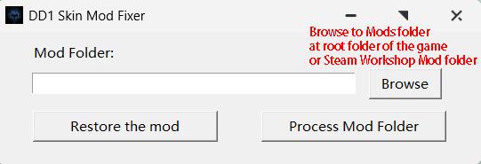

# DD1 Skin Mod Fixer

A tool that fixes aliasing (jagged edges) in Darkest Dungeon 1 skin mods by resizing high-resolution sprite sheets.

## The Problem

Many DD1 skin mods have aliasing issues - jagged, flickering edges on characters. This happens because the sprite sheets are too large for the game engine to handle properly (Nyquist frequency issue).

## The Solution

This tool automatically:
1. Scans your mod folder for skin mods
2. Resizes sprite sheets to a safe resolution
3. Updates atlas files with new coordinates
4. Creates a backup before making changes

## Download

Download the latest release: [DD1SkinFixer.exe](https://github.com/YourUsername/dd1-skin-fixer/releases)

## Usage

1. Run `DD1SkinFixer.exe`
2. Click **Browse** and select your mods folder
   - Steam Workshop: `Steam\steamapps\workshop\content\262060`
   - Local mods: `Darkest Dungeon\mods`
3. Click **Process Mod Folder**

### Restore Original Files

If something goes wrong:
1. Click **Browse** and select the same mods folder
2. Click **Restore the mod**
3. Your original files will be restored from backup

## Supported Mods

This tool works on skin mods that include custom Spine animations, 
works for both new hero class mods and vanilla skin replacement mods. 
Mods that does not has reskin will be skipped.
(Monster Reskin Mods support in progress) 

## License

MIT License - feel free to use and modify.

## 中文说明

[点击这里查看中文文档](README_CN.md)