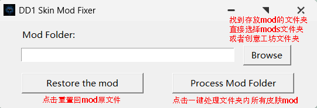

# DD1 皮肤Mod锯齿修复工具

通过缩小高分辨率贴图来修复暗黑地牢1皮肤Mod锯齿问题的工具。

## 为什么有锯齿？

因为mod大佬使用了太过高清的贴图，超出了游戏古老引擎的处理能力（奈奎斯特频率问题）。导致很多DD1皮肤Mod存在锯齿问题，非常的难看。

## 工具功能

本工具可以自动完成以下操作：
1. 扫描Mod文件夹中的皮肤Mod
2. 将贴图缩小到安全分辨率
3. 更新atlas文件中的坐标
4. 在修改前自动创建备份

## 下载

下载最新版本：[DD1SkinFixer.exe](https://github.com/YourUsername/dd1-skin-fixer/releases)

## 使用方法

1. 运行 `DD1SkinFixer.exe`
2. 点击 **Browse** 选择你的Mod文件夹
   - Steam创意工坊：`Steam\steamapps\workshop\content\262060`
   - 本地Mod：`Darkest Dungeon\mods`
3. 点击 **Process Mod Folder**

### 恢复原始文件

如果出现问题：
1. 点击 **Browse** 选择相同的Mod文件夹
2. 点击 **Restore the mod**
3. 原始文件将从备份中恢复

## 支持的Mod类型

任何有自定义骨骼动画的皮肤Mod。
同时支持新英雄mod和原版英雄换肤mod。
（一键处理怪物娘化mod计划在未来更新，现版本暂不支持）

## License

MIT License - 可自由使用和修改。

## English Version

[Click here for English documentation](README.md)